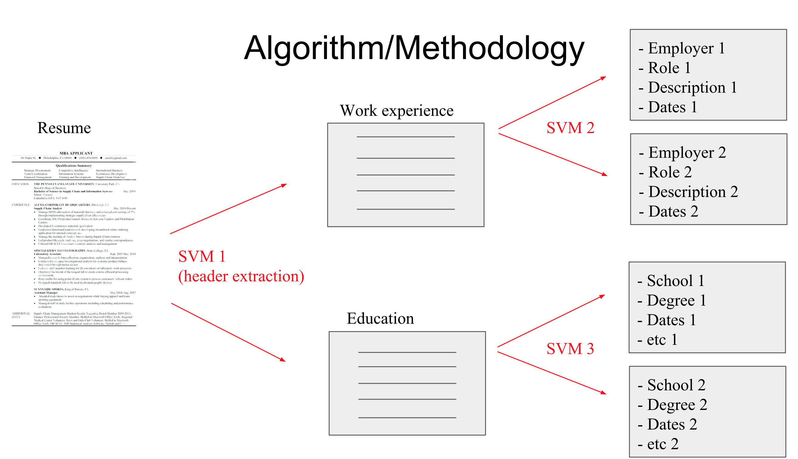
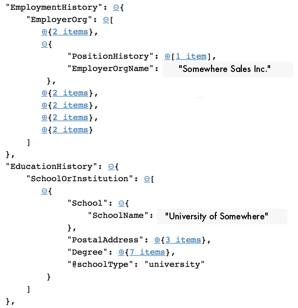
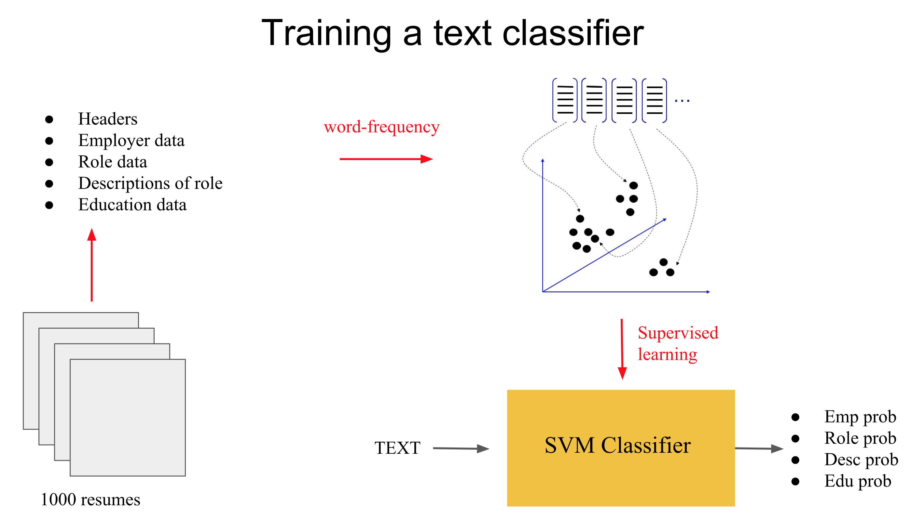
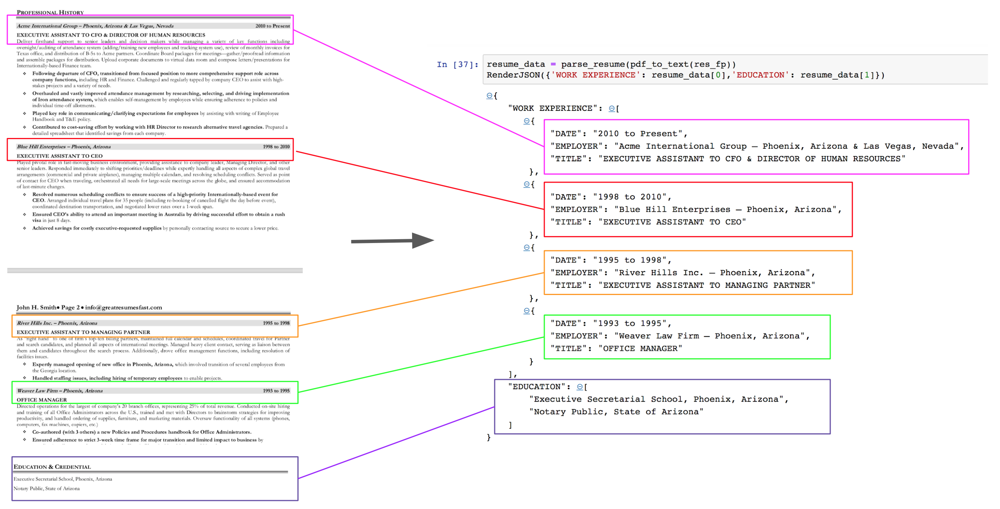
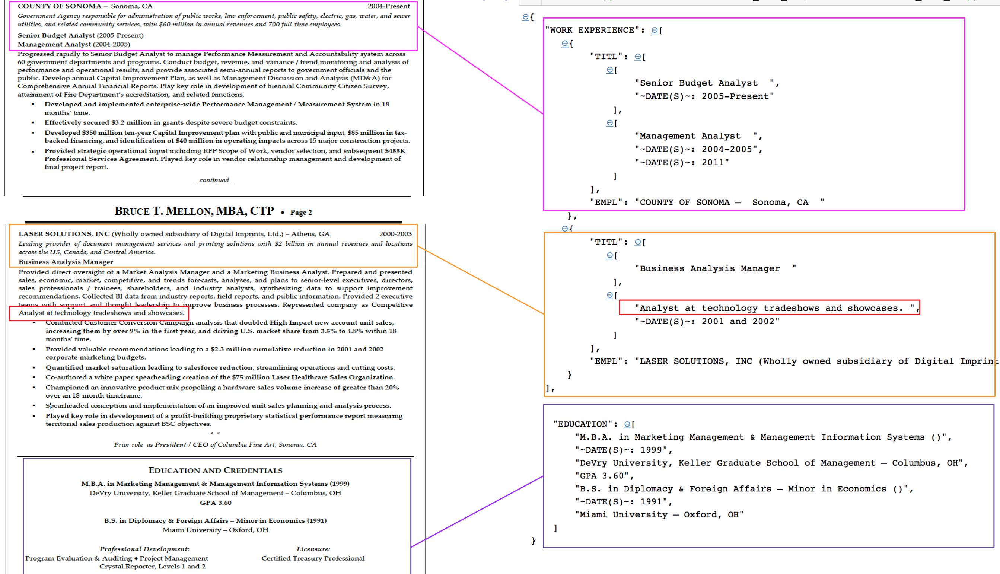

# FinParse:  A custom parser for financial resumes

In this repo I develop a machine learning based tool for parsing financial resumes.  The training set consists of ~ 1000 resumes pre-parsed by a professional parsing service.  Unfortunately I cannot make the training data available to the public due to privacy concerns.  I am hoping to improve upon this situation in the future by scraping publicly available resume data.  In the meantime,  the basic functions and learning algorithms are demonstrated in the notebook FinParse_workflow.py.  In principle the algorithm deployed here could be used for resumes from any sector (or even across sectors) given the appropriate training set.

Note:  The resumes used for demonstration were found through a google search.   

## The algorithm

The algorithm takes a resume in .pdf format and returns a python dictionary containing parsed data pertaining to work experience and educational background.  These categories could be expanded, but I started with this since it is usually the core information on a resume.  After the .pdf resume is converted into text format, the parsing takes place in several steps:

1.  Splitting the text on line breaks and greater than 5 spaces
2.  Identification and classification of headers 
3.  Splitting of the resume lines into work experience and educational background based on the header analysis
4.  Classifying the lines within work experience as Employer, Role or Description
5.  Grouping the parsed lines into associated clusters (e.g. grouping employers and roles)

The classification steps of the process are summarized in the following figure:



## Training the classifiers

The output of the professional parser is a json file containing labeled chunks of data from the parsed resumes.  A sample output is shown below.



It is important to note that the parser does not give us a line-by-line annotation of the resume.  If this were the case, training sophisticated models could be considered.  (In the future I am planning to explore ''reverse-annotating'' the resume lines using the parsed data and to explore the possibilities.)  As it is, what we have are a bunch of extracted lines of text which are labeled as Employer, Title, University, Degree, etc.  Thus we are in a situation where we can train a classifier to identify chunks of text as belonging to these various groups.  The simplest approach is to just use word count to convert each chunk into a vector and then classify these vectors.  This process works quite well since the word content of these various groups is fairly unique.  A summarization of the process is shown in the figure below.



As stated above, we train a few different classifiers.  The first is the function ```head_class``` used to identify headers.  For example:

```
head_class(['PROFESSIONAL HISTORY'])
```
returns 

```
('HEAD_WORK', array([[0.95855134, 0.00980513, 0.01170021, 0.01994332]]))
```

The first element of the tuple indicates that the text has been classified as the header for a work experience section.  The second element of the tuple gives the probability that the text belongs to one of the header classes 

```
[HEAD_WORK, HEAD_EDUC, HEAD_CERT, HEAD_OTHR]
```

The second type of classifier is used to identify information within a particular section.  For example within the work section we use the classifier ```text_class_wrk``` to distinguish between employer, role and description.    For example:

```
text_class_wrk(['Management Analyst'])
```

returns

```
('TITL', array([[0.00873307, 0.9327617 , 0.05850523]]))
```

The first element of the tuple indicates that the text has been classified as a title.  The second element of the tuple gives the probabilities that the text belong to one of the header classes ```[EMPL, TITL, DESC]```.

## Clustering information

At the end of the classification stage we have a bunch of classified lines schematically of the form:

```
DESC <== PROFESSIONAL HISTORY  
EMPL <== Acme International Group - Phoenix, Arizona & Las Vegas, Nevada  
UNKN <==  
DATE <== 2010 to Present
TITL <== EXECUTIVE ASSISTANT TO CFO & DIRECTOR OF HUMAN RESOURCES 
DESC <== Deliver  firsthand  support  to  senior  leaders  and  decision  makers  while  managing  a  variety
DESC <== Texas office, and distribution of B-5s to Acme partners. Coordinate Board packages for meetings - ga
DESC <== Internationally-based Finance team. 
DESC <== (cid:1)  Following departure of CFO, transitioned from focused position to more comprehensive suppor
DESC <== (cid:1)  Overhauled and vastly improved attendance management by researching, selecting, and driving
DESC <== (cid:1)  Played key role in communicating/clarifying expectations for employees by assisting with wr
DESC <== Handbook and T&E policy. 
DESC <== (cid:1)  Contributed to cost-saving effort by working with HR Director to research alternative trave
EMPL <== Blue Hill Enterprises - Phoenix, Arizona 
UNKN <==  
DATE <== 1998 to 2010
TITL <== EXECUTIVE ASSISTANT TO CEO 
DESC <== Played pivotal role in fast-moving business environment, providing assistance to company leader, Man
```

Here the label UNKN means that the text contained no recognized words (no words in the dictionary of the classifier).  The problem is to combine these lines into associated groups.  For example, lines may be labeled as Employer, Title, Date, etc.  Now we want to associate the date with the title and the title with a particular employer.  

## input/output example

Finally, we demonstrate the capability of the parser on two example resumes.  The structural differences in the formatting of the work experience sections demonstrate the variability of the input and why it is necessary to have a flexible parsing algorithm.  The output of the parser for the two cases is shown below:

Example resume 1:



Example resume 2:




